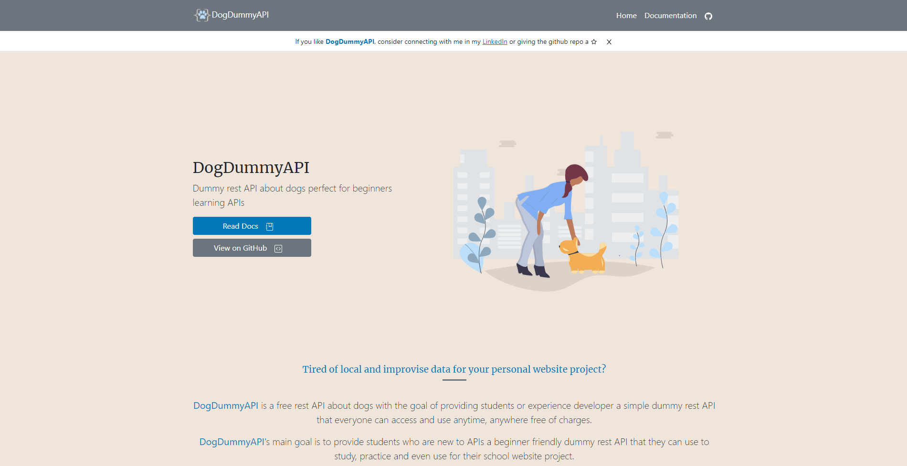

# DogDummyAPI

**Dummy rest API about dogs perfect for beginners learning APIs**

## About

[DogDummyAPI](https://dogdummyapi.netlify.app/get-started) was a made with the intention of helping the beginner by providing a **Free** and **Simple** rest API that they can use for learning APIs and can also use for their dummy website to include for their portfolio.

---

Learn more by visiting the github documentation of [DogDummyAPI](https://dogdummyapi.netlify.app/get-started) by [Vince Jepoy Mendoza](https://www.linkedin.com/in/vince-jepoy-mendoza-5b93a6223/)
